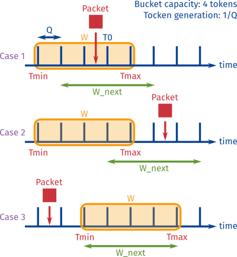

# tbpoc-bpf

Stateful packet processing: two-color token-bucket PoC in BPF

## What is it?

This is an example use case of a stateful eBPF application. The C source code
can be compiled into an eBPF program that implements a rate limiter, in the
shape of a two-color token bucket. It is expected to be attached to the tc
(“traffic control” Linux tool) of a network interface.

## Run it

### Requirements

Linux is required, with kernel version 4.5.0 (necessary for packet direct
access with eBPF).

### Preparation

Files `bpf_api.h` and `bpf_elf.h` both come from package
[iproute2](https://git.kernel.org/cgit/linux/kernel/git/shemminger/iproute2.git/)
(they are located at `iproute2/include/bpf_api.h` and
`iproute2/include/bpf_elf.h`). There are to cases to consider:

* Either those files are present on your system, and you should edit the
  include in file `opp.h` to point to your own version of `bpf_api.h`.
* Or you have to get the correct version for those files, that is to say the
  version matching your kernel headers:

    * Clone iproute2 package.
    * Checkout the commit with the tag associated to your kernel
    * Overwrite `bpf_api.h` and `bpf_elf.h` with the ones from iproute2 version
      associated to your kernel.

File `proto.h` comes from [bcc](https://github.com/iovisor/bcc) set of tools
(`bcc/src/cc/export`), from IO Visor project (and was slightly modified). You
should not have to edit it.

### Compilation

LLVM and clang version 3.7 or superior are needed.

The command line needed to compile the C source code into eBPF bytecode was
placed in a `Makefile` for simplicity. So once you have cloned the repository
and changed into its directory, you can simply type:

    $ make

This produces an ELF file (extension `.o`), with the bytecode placed in section
`classifier`.

### Usage

To run the program, attach it to a network interface. For instance, you can
first create a `qdisc` with tc:

    # tc qdisc add dev eth0 clsact

Then attach the program to this qdisc, for example on the `ingress` interface:

    # tc filter add dev eth0 ingress bpf da obj tokenbucket.o

The rate limiter should now be attached to interface `eth0`. It tries to
process packets. But the application will not work yet: we first have to
initialize the maps. To this end, you can compile and run the program in file
`init_maps.c`:

    $ gcc -o init_maps init_maps.c
    # ./init_maps

Once the maps are initialized (well, one of them starts empty actually), the
token bucket should correctly work.

Note that there is no “simulation” setup in this repository as for the [port
knocking](https://github.com/qmonnet/pkpoc-bpf) example enabling to configure
several namespaces with bcc and to run the token bucket in one of these, but if
you ever need it, it should not be hard to adapt.

## Token bucket principle

The token bucket is represented by a bucket containing up to `B` tokens. The
token regenerates at a constant rate `Q`. Each time a packet is forwarded, a
token is consumed. If there is no token left when a packet arrives, it is
dropped instead of being forwarded.

The implementation is slightly different, and does not involve a token counter.
Instead, it relies on a sliding window W, which is shifted on the right (it
becomes `W_new`) each time a packet is processed. Depending on the window
position at the packet arrival time, three cases may occur:

1. If the packet arrives “in” the window, it is forwarded and the window shifts
   to the right.
2. If the packet arrives “before” the window, on its right, the window has not
   been shifted for “too long”: its position is reinitialized on the current
   packet time, and the packet is forwarded.
3. However, if the packet arrives “after” the window, on its left, then the
   window has shifted “too much” already: too many packets have been forwarded
   over the last span of time, and the current one is dropped. The window
   position is unchanged.

## Open Packet Processor interface

Open Packet Processor (OPP) is an abstract interface developed in the context
of [BEBA research project](http://www.beba-project.eu/) (Horizon 2020). It
enables stateful processing operations for programmable switches in Software
Defined Networks.

For the token bucket use case, we use the OPP interface in order to:

* implement state conservation (underlying mechanism: eBPF maps),
* implement per-flow as well as global variables or “registers”,
* and evaluate conditions on the packets; concretely, to evaluate whether the
  arrival time, in regard to the current position of the window, puts these
  packets in the first, the second or the third case of the token bucket
  mechanism described above.

A full description of the interface is available in [this
paper](https://arxiv.org/abs/1605.01977). There is also a shorter description
of the interface in [this blog
post](https://qmonnet.github.io/whirl-offload/2016/07/17/openstate-stateful-packet-processing/).

## License

* File `proto.h` comes from bcc and is released under Apache v2.0 license.
* Files `bpf_api.h` and `bpf_elf.h` come from iproute2 package and are released
  under GPL license v2.
* Other source code files are under GPL license, version 2, mainly because the
  program must be GPL in order to use the map-related eBPF helpers in the
  kernel.
* Token bucket diagram are under license Creative Commons CC-by.
